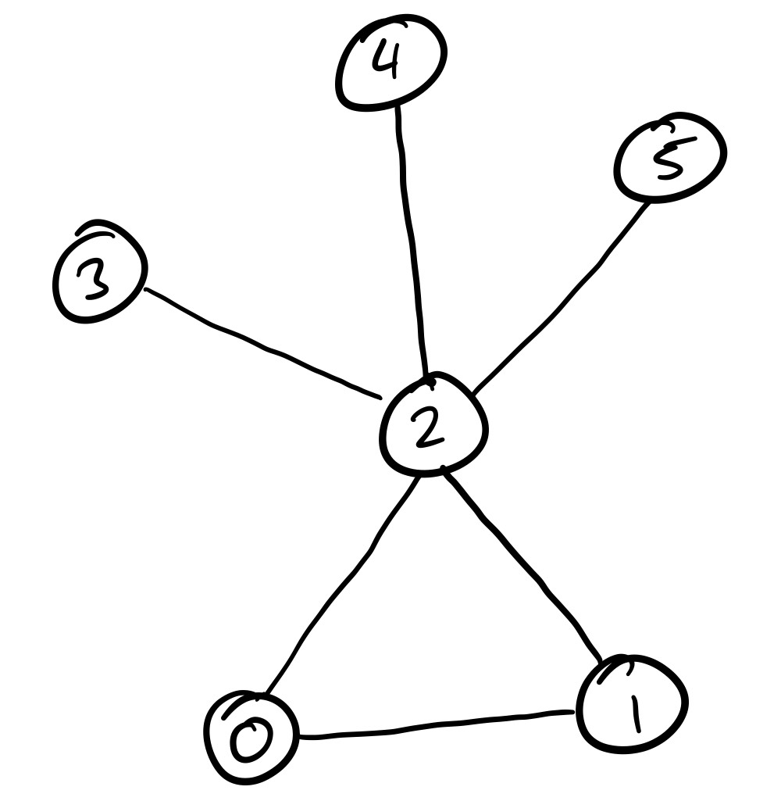
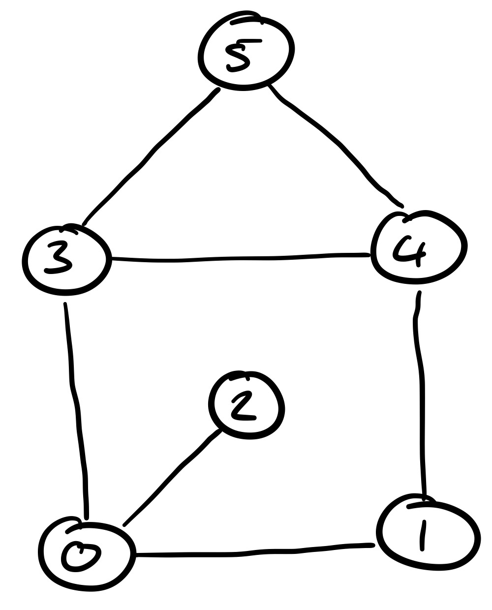

+++
date = '2025-12-10T12:52:40Z'
draft = false
title = 'Quantum Annealing Using DWave: A Practical Introduction'
tags = ['Quantum Computing', 'Quantum Annealing', 'Tutorial']
+++


This post acts as an introductory tutorial to using [DWave's OceanSDK](https://github.com/dwavesystems/dwave-ocean-sdk)
to perform quantum annealing (QA), which is a method for solving optimisation problems.
This intends to serve as a purely practical introduction to QA, not a theoretical one.
We do discuss some theory, but it's something that we gloss over since it is something
that is worthy of a post in its own right.

In terms of prerequisites for following the tutorial, all that is expected is
- Familiarity with python
- Comfort with maths
- For one of the problems discussed: a basic understanding of [graphs](https://en.wikipedia.org/wiki/Graph_(discrete_mathematics))

## What is Quantum Annealing?
In this section, we introduce some of the ideas behind QA. The key parts of this
is the notion of the Ising and QUBO models since these are how we encode problems
that we wish to solve with QA. We then discuss (very briefly) how QA is performed,
this subsection is _not required_ to follow the tutorial but I felt that having
even a little bit of intuition is better than having no understanding at all.

For those who are interested in the details, a post will follow at a later date
discussing the theory in more detail.

### The Ising Model
The [Ising model](https://en.wikipedia.org/wiki/Ising_model) is a lattice model which was devised to model ferromagnetism and
is used in statistical mechanics. For our uses, the following understanding is
sufficient: let \\(s_1, \dots, s_n \in \\{-1, 1\\}\\), we call these variables "spins".
Then the _hamiltonian_ of the Ising model is
$$
H(s_1, \dots, s_n) = \sum_{i=1}^n \sum_{j=i+1}^n J_{ij} s_i s_j + \sum_{i=1}^n h_i s_i
$$
The hamiltonian is simply a measure of the _energy_ in the model. We call the
\\(J_{ij}\\) the quadratic/interaction coefficients and the \\(h_{i}\\) the linear coefficients.
We refer to the global minima of this hamiltonian as its _ground state_.

From a computational perspective, the key idea is to formulate our optimisation
problems using the above model _such that the optimal solutions coincide with the
ground state of the hamiltonian_. That is: if some set of spins give us the ground
state, then they tell us a solution (and vice versa). Later, we will see how we can do this using 3
problems.

#### QUBO Model
The [QUBO](https://en.wikipedia.org/wiki/Quadratic_unconstrained_binary_optimization) 
model is mostly analogous to the Ising model, except we use binary
variables \\(x_1, \dots, x_n \in \\{0, 1\\}\\) instead.
$$
H(x_1, \dots, x_n) = \sum_{i=1}^n \sum_{j=i+1}^n Q_{ij} x_i x_j + \sum_{i=1}^n Q_{ii} x_i
$$
The key difference is that presentations of the QUBO model will store both the
quadratic and linear coefficients in a single matrix. For consistency, we will
call the global minima of the above function its _ground state_.

The QUBO and Ising models are equivalent. To see this, notice that we can easily map
between the binary variables and spins using the following relation for all \\(1 \le i \le n\\):
$$
s_i = 2 x_i - 1
$$
Then we have that \\(s_i = 1 \iff x_i = 1\\) and \\(s_i = -1 \iff x_i = 0\\).

### Quantum Annealing
Let's finally introduce the main idea of quantum annealing (while skipping over
some details). Remember, this section is not required to follow the tutorial;
do not feel disheartened if you struggle to understand the upcoming material.

QA is a type of [adiabatic quantum computing](https://en.wikipedia.org/wiki/Adiabatic_quantum_computation) (AQC)
which in general follows these "simple" steps:
1. Find a hamiltonian (i.e. an Ising or QUBO model) where ground states represent solutions.
2. Choose a simple hamiltonian (different to the problem) where we can easily find its ground state.
3. Slowly transform the simple hamiltonian into the one which represents our problem.

By the [adiabatic theorem](https://en.wikipedia.org/wiki/Adiabatic_theorem), if this transformation is slow enough, then the overall system will
remain very close to its lowest energy state (and thus when we reach the system
representing our problem, we will have a solution).

#### The Details
We will now move on to some grittier details. Since the libraries will abstract
these details away, it's perfectly reasonable to skip this section for the sake
of this tutorial.

Suppose we have formulated our problem as an Ising model (either
directly, or by formulating as QUBO and converting), with coefficients \\(J_{ij}\\)
and \\(h_{i}\\). Recall that our Ising hamiltonian was a scalar function \\(H \colon \\{-1, 1\\}^n \rightarrow \mathbb R\\),
QA does not actually use this hamiltonian, instead it uses:
$$
H_0 = \sum_{i=1}^n \sum_{j=i+1}^n J_{ij} \sigma^z_i \sigma^z_j + \sum_{i=1}^n h_i \sigma^z_i
$$
This is **not a function**, it is an operator/matrix. Each of the \\(\sigma^z_i\\) are
_Pauli_ \\(z\\) _operators_ which act on the \\(i\\)-th qubit. The details of what
this all means will not be discussed in this post, as it is an entire topic on
its own. We refer to \\(H_0\\) as the _problem hamiltonian_.

Then we combine this with a different, non-commuting hamiltonian:
$$
H_1(t) = \Gamma(t) \sum_{i=1}^n \Delta_i \sigma^x_i
$$
We refer to \\(H_1\\) as the _driving hamiltonian_, as this is what induces quantum
tunneling and allows us to find our minima. Note that we choose \\(\Gamma\\) such that 
\\(\Gamma(t) \rightarrow 0\\) as \\(t \rightarrow \infty\\). Thus our full hamiltonian is
$$
H(t) = H_0 + H_1(t)
$$
Clearly, this fits with our intuition. This is because \\(H(t)\\) is representing
something different to our problem, but over time \\(H_1(t)\\) vanishes, leaving
\\(H_0\\) on its own, which indeed represents our problem.

This allows us to begin to solve the time-dependent Schrödinger equation (a PDE), which
gives us the wavefunction \\(|\psi(t)\rangle\\) of our system.
$$
i \hbar \frac{\partial |\psi(t)\rangle}{\partial t} = H(t) |\psi(t)\rangle
$$
Here, \\(\hbar\\) is the _reduced Planck constant_. Note that here, and in
most places discussing quantum physics, [Bra-ket Notation](https://en.wikipedia.org/wiki/Bra%E2%80%93ket_notation)
is common place.

## Applying Quantum Annealing
[DWave](https://www.dwavequantum.com/) is a company which does extensive research
into quantum computing and has released several QPUs (Quantum Processing Units)
dedicated to performing quantum annealing.

They provide a decent python library for formulating problems in the QUBO or Ising
models, and provide classes which makes either _simulating_ QA locally or using
real QA via their cloud services extremely easy.

In this section, 3 different computational problems in order to provide examples as to how to use QA to solve them.
If you wish to follow along, then setup a python environment (optional) and install the DWave library:
```bash
pip install dwave-ocean-sdk
```


### Positive Set Partition Problem
#### Problem Statement
We define the positive set partition problem as follows. Given a set
\\(N = \\{n_1, n_2, \dots, n_k\\}\\) where all the \\(n_i \ge 0\\),
find a partition \\((A, B)\\) (i.e. two sets \\(A, B\\) such that
\\(A \cap B = \emptyset\\) and \\(A \cup B = N\\)) such that
$$
    \sum_{a \in A} a = \sum_{b \in B} b
$$
Note that this is equivalent to
$$
    \sum_{a \in A} a - \sum_{b \in B} b = 0
$$

#### Formulation
Now this is the key idea, since \\((A, B)\\) is a partition, every element of \\(N\\)
appears in the equation above. Further, every element of \\(N\\) is positive,
therefore, the equation boils down to choosing \\(s_1, \dots, s_k \in \\{-1, 1\\}\\)
such that:
$$
    s_1 n_1 + s_2 n_2 + \cdots + s_k n_k = 0
$$
where \\(s_i = 1\\) iff \\(n_i \in A\\) and \\(s_i = -1\\) iff \\(n_i \in B\\).

Therefore, we will choose to use the Ising model to represent this problem. It's
difficult to write down the hamiltonian in the correct form straight away though,
so we write down _any function_ in terms of the \\(s_i\\) whose minima coincide
with solutions to the problem.

A function which does this job, in this instance, is simply the one which we
have written above.
$$
    H(s_1, \dots, s_k) = A \left( \sum_{i=1}^k s_i n_i \right)^2
$$
has a ground state which corresponds with a solution to our problem for any \\(A > 0\\).

What is the significance of \\(A\\) here? QA struggles when the energy (the value
of the hamiltonian) is extremely large, hence having the coefficient allows us to
scale the energy without deforming the "energy landscape", i.e. all the extrema
remain in the same places.

Now, \\(H\\) is not in Ising form, we cannot see what our \\(J_{ij}\\) and our \\(h_i\\)
coefficients are. We can simply expand the squared term to get:
$$
    H(s_1, \dots, s_k) = \sum_{i=1}^k \sum_{j=i+1}^k 2A n_i n_j s_i s_j + \sum_{i=1}^k A n_i^2
$$
We can clearly see that our \\(J_{ij} = 2An_in_j\\) and \\(h_i = 0\\).

Note that since we are optimising, the constant term (i.e. the term that doesn't depend on
our function arguments \\(s_i\\)) can simply be ignored. Further, after dropping the constant term,
we _could_ absorb the factor of 2 into our energy scaling.

#### Implementation
We will now use DWave's library to implement a solution to this problem. We will
drop the constant term, which will leave us with the following hamiltonian:
$$
    H(s_1, \dots, s_k) = \sum_{i=1}^k \sum_{j=i+1}^k 2An_in_j s_i s_j
$$
where \\(s_1, \dots, s_k \in \\{-1, 1\\}\\). I've chosen not to absorb the factor of
2 into the energy scaling as a matter of preference, but feel free to do so yourself.

DWave requires us to construct a `BinaryQuadraticModel` (BQM) object for our problem.
This class has two static methods `from_ising(h, J)` and `from_qubo(Q)` which
will return an instance of `BinaryQuadraticModel` which reflects the Ising model
or QUBO model respectively. The nice thing about using DWave is it will handle
conversion to and from both models for us, so had we used QUBO to start with,
we wouldn't have to bother with the manual labour of converting to Ising.

Now, we want our implementation to handle any set \\(N\\) and any choice of scale
factor \\(A\\), so we will create a function that returns a `BinaryQuadraticModel`
for a given instance of our problem.
```python
from dimod import BinaryQuadraticModel

def set_partition_bqm(ns_set, a=1.0):
    # The matrix J
    quadratic_coeffs = {}

    # Fill up our matrix J with our quadratic coefficients as defined above
    k = len(ns_set)
    for i in range(k):
        for j in range(i+1, k):
            # Recall: J_ij = 2 * A * n_i * n_j
            quadratic_coeffs[(i, j)] = 2 * a * ns_set[i] * ns_set[j]

    # Now we can construct the bqm
    # We didn't have any linear coefficients, so we can just pass an empty dict
    return BinaryQuadraticModel.from_ising({}, quadratic_coeffs)
```

So now we have the BQM representing our model. How do we use this with QA?
DWave provides [a few of subclasses](https://docs.dwavequantum.com/en/latest/ocean/api_ref_samplers/index.html) of `Sampler`, not all of them perform QA,
so we only use 2 here.

If you do not wish to use DWave's cloud services, you can use `PathIntegralAnnealingSampler`
which simulates QA.
```python
from dwave.samplers import PathIntegralAnnealingSampler
sampler = PathIntegralAnnealingSampler()
```

Otherwise, setup your environment for usage with the DWave cloud services by
following [this guide](https://docs.dwavequantum.com/en/latest/ocean/install.html)
and use
```python
from dwave.system import DWaveSampler, EmbeddingComposite
sampler = EmbeddingComposite(DWaveSampler())
```

The following will be the same regardless of your choice. We can now use the
`sample` method with our BQM to perform QA. The result of this will be a `SampleSet`,
since QA is an iterative process, the sample set will contain all the \\(s_1, \dots, s_k\\)
assignments the sampler tried while hunting for minima. We are only concerned in the
best one it found (i.e. the one with lowest energy).
```python
sample_set = sampler.sample(bqm)
best = sample_set.first
```

`best` contains information about what "sample" (the assignments to the \\(s_i\\))
was, as well as the energy value obtained with this sample. As discussed before, we can uncover the partition
that this result encodes by looking at the values of the \\(s_i\\) in the sample.
```python
def partitions_from_sample(ns_set, sample):
    a = []
    b = []

    for i, n in enumerate(ns_set):
        if sample[i] == 1:
            a.append(n)
        else:
            b.append(n)
    
    return a, b

a, b = partitions_from_sample(ns_set, best.sample)
```

We can now glue these pieces of our implementation together, and provide a set
\\(N\\) (`ns_set` in the code) to see what happens.

If you are following along, here are some things you may want to try:
- Try \\(N = \\{1, 2, 3, 4, 5, 6, 7, 8, 9, 10\\}\\). What do you expect? What do you get?
- Try \\(N = \\{25, 36, 39, 100\\}\\). Again, what do you expect? What do you get?
- How about a set where no such partition exists, say \\(N = \\{2, 4, 6, 8, 51\\}\\)?

### Minimum Vertex Cover Problem
#### Problem Statement
Consider a graph \\(G = (V,E)\\) where \\(V\\) is the set of vertices and
\\(E \subseteq V \times V\\) is the set of edges. A vertex cover is a set
\\(C \subseteq V\\) such that for all \\((u,v) \in E, u \in C\\) or \\(v \in C\\).

The minimum vertex cover problem is defined as follows. Given a graph \\(G = (V,E)\\),
find a vertex cover \\(C \subseteq V\\) with the least amount of elements.

We just consider undirected graphs in this case.

#### Formulation
First of all, \\(V\\) is certainly finite so write \\(V = \\{v_1, \dots, v_n\\}\\).
Since we want to know whether or not each \\(v_i \in C\\), it makes more sense to
use binary variables and hence a QUBO formulation here.

We define \\(x_1, \dots, x_n \in \\{0, 1\\}\\) such that \\(x_i = 1\\) if and only if
\\(v_i \in C\\). Then the length of our vertex cover \\(C\\) is
$$
\\#C = \sum_{i=1}^n x_i
$$

Now, by definition, for every edge \\(v_i, v_j\\) in the graph, we require that
either \\(v_i \in C\\) or \\(v_j \in C\\). Hence, in terms of the binary variables
we require \\(x_i = 1\\) or \\(x_j = 1\\). Therefore 
$$
    x_i + x_j \ge 1
$$
Constraints of this form has no place in QUBO, we must reformulate this condition as an expression which is 0 if the constraint
holds, and is greater than 0 otherwise. One can show that this expression does the job:
$$
    1 - x_i - x_j + x_i x_j
$$

Now, both our equation for \\(\\#C\\) and our expression for our constraint are
greater than or equal to 0 already, so no squaring is required. Our hamiltonian,
with added energy scaling coefficients (\\(A, B > 0\\)), is therefore:
$$
    H(x_1, \dots, x_n) = A \sum_{i=1}^n x_i + B \sum_{(v_i, v_j) \in E} \left( 1 - x_i - x_j + x_ix_j \right)
$$
All we've done here is added our two constraints (those being: the subset must be a vertex cover,
and the subset must have minimum length) together.

The second term acts as a penalty for infeasible solutions, i.e. if \\(x_1, \dots, x_n\\)
does not represent a vertex cover, then this term is non-zero.

We now rewrite this in standard QUBO form. We introduce the notion of an _indicator function_ here,
which serves no purpose but to simplify notation:
$$
\mathbf{1}[\text{condition}] = \begin{cases}
    1 & \text{condition is true} \\\\
    0 & \text{condition is false}
\end{cases}
$$
We also define what we mean by a _degree_ of a vertex for the same reason. For any \\(v \in V\\), \\(\text{deg}(v)\\)
is the number of edges incident to the vertex. In the context of an undirected graph,
this is simply the number of edges connected to it.

With these two things in mind, one can find that the hamiltonian in QUBO form is,
after dropping constant terms:
$$
H(x_1, \dots, x_n) = \sum_{i=1}^n \sum_{j=i+1}^n \left( Bx_ix_j \cdot \mathbf{1}[(v_i, v_j) \in E] \right)
$$
$$
\+ \sum_{i=1}^n x_i(A - B \text{deg}(v_i))
$$
Thus we can form our matrix \\(Q\\) as follows:
$$
    Q_{ii} = A - B \text{deg}(v_i)
$$
for all \\(i = 1, \dots, n\\).
$$
    Q_{ij} = \begin{cases}
        B & (v_i, v_j) \in E \\\\
        0 & (v_i, v_j) \notin E
    \end{cases}
$$
for all \\(i = 1, \dots n\\) and \\(j = i+1, \dots, n\\).

#### Implementation
Let's form our BQM. This BQM depends on the graph and the two energy scaling
parameters \\(A\\) and \\(B\\). So we create a function which builds it for us.
This function returns a `BinaryQuadraticModel` (BQM) object using its static
method `from_qubo(Q)` where the `Q` is the matrix we defined above.

Now, your exact implementation depends on how you wish to represent the graph,
I will be using an adjacency matrix which indexes vertices from 0, where 
`matrix[i][j] = matrix[j][i] = 1` if \\((v_i, v_j) \in E\\)
and `matrix[i][j] = matrix[j][i] = 0` otherwise

```python
from dimod import BinaryQuadraticModel

# Helper method for getting the degree of i-th vertex
def degree(adj_matrix, i):
    # Entries are binary (0,1), so sum the i-th row
    return sum(adj_matrix[i])

def min_vert_cover_bqm(adj_matrix, a=1.0, b=1.0):
    q = {}
    n = len(adj_matrix)

    for i in range(n):
        q[(i, i)] = a - b * degree(adj_matrix, i)
        for j in range(i+1, n):
            # Interaction coeff != 0 <=> edge exists
            if adj_matrix[i][j] == 1:
                q[(i, j)] = b

    return BinaryQuadraticModel.from_qubo(q)
```

Now, we would use this BQM the exact same way as any other BQM (if you're unsure
check the set partition implementation), so we just need to be able to interpret
the samples.

```python
def vert_cover_from_sample(sample):
    return [i for i, s in sample.items() if s == 1]
```

So once again, all there is left to do is to glue the pieces together, and provide
a graph \\(G\\).

If you're following along, here are some things you may want to try.
- Try your solution with following graph. What do you expect? What do you get?

- What about this graph?

- Try to reimplement the solution to allow for vertices labelled with a string.

Now, I can almost guarantee that if you attempted the above exercises naively,
then you will have received wrong answers! Assuming that you have done everything
up to this point correctly, you could get wrong answers for a few reasons.

The first is a technicality in terms of _energy scaling_. By default, we set \\(A = B > 0\\).
However, the constraints for \\(A\\) and \\(B\\) represent different things. Recall that
- The \\(A\\) term represents _minimality_
- The \\(B\\) term represents _feasibility_

So, if you're getting a small set which _isn't_ a vertex cover (i.e. not a feasible solution),
then this is an indication we must put more emphasis on feasibility than minimality. In short:
fiddle with the energy scaling parameters!

The second is the easiest to fix: _you're simply not annealing for long enough_.
The `sample` method uses default parameters `num_reads=1000` and `annealing_time=50`.
You can think of `num_reads` as the amount of "iterations" to do, and `annealing_time` to be
the time spent on each "iteration". 
```python
sampler.sample(bqm, num_reads=1500, annealing_time=100)
```

Of course, these two categories of errors aren't absolute, your problems may be
due to a combination of these two problems!

### Modular Subset Sum Problem
#### Problem Statement
The problem is defined as follows. Fix \\(m \in \mathbb N\\).
Given a multiset \\(A = \\{a_1, \dots, a_n\\} \subseteq \mathbb Z^{\ge 0}\\)
and a target \\(t \in \mathbb Z_m = \\{0, 1, \dots, m-1\\}\\), assign values to
\\(x_1, \dots, x_n \in \\{0,1\\}\\) such that
$$
\sum_{i=1}^n x_i a_i \equiv t \mod m
$$
For those who do not know what this means, we say that \\(a \equiv b \mod c\\)
if and only if \\(c\\) divides \\(a-b\\), or equivalently, \\(a = kc + b\\) for some
integer \\(k\\). Thus our objective becomes: assign \\(x_1, \dots, x_n\\) and find
\\(k \in \mathbb Z^{\ge 0}\\) (here \\(k \ge 0\\) since any sum from our
multiset will be positive) such that
$$
\sum_{i=1}^n x_i a_i - (t + km) = 0
$$

#### Formulation
This looks a lot like the set partition problem's objective, and we will mostly
proceed the same way by taking the hamiltonian as the square of this function.
However, we do not know what \\(k\\) is ahead of time, and we need to find it
as a part of our optimisation, so we encode it in binary using \\(l\\) bits:
$$
    k = \sum_{i=1}^l 2^{i-1} y_i
$$
for \\(y_1, \dots, y_l \in \\{0, 1\\}\\). We can choose \\(l\\) based on the bitlength
of the maximum subset sum of \\(A\\). Due to the amount of \\(\\{0,1\\}\\) variables, this
is better suited to a QUBO formulation. Our hamiltonian is
$$
    H(x_1, \dots, x_n, y_1, \dots, y_l) = A \left( \sum_{i=1}^n x_i a_i - \left(t + m \sum_{i=1}^l 2^{i-1}y_i \right) \right)^2
$$

Then we convert this into QUBO form, just like the last few problems. However,
I want to take this opportunity to introduce another library into the mix: [PyQUBO](https://doi.org/10.48550/arXiv.2103.01708).
This will handle the manipulation for us!

#### Implementation
As stated at the end of the last subsection, rather than giving DWave the coefficients
directly like we have in the past few examples, we will be using PyQUBO to calculate
these coefficients for us. If you're following along, install the library (in the
same environment, we will still need DWave!)
```
pip install pyqubo
```

There's many ways we can go about this using PyQUBO, since it gives us a way to
define individual variables using `Binary` for \\(\\{0, 1\\}\\) and `Spin` for
\\(\\{-1, 1\\}\\). It also gives us a short cut for defining arrays of variables with
`Array`. If we really wanted to, we could use `LogEncInteger` as a shortcut for defining
\\(k\\) in terms of binary variables as we have above. For this post, we're 
going to stick with `Array` since I think this best highlights how PyQUBO lets 
us build complicated hamiltonians very quickly.

Instead of our first function returning the BQM, we will return the compiled
model that PyQUBO gives us, since we will use this to decode the sample later.
```python
from pyqubo import Array
from math import log2, ceil

def modular_subset_sum_model(multiset, t, m, a=1.0):
    n = len(multiset)

    # Creates an array of binary variables
    # x[0], ..., x[n]
    x = Array.create("x", shape=n, vartype="BINARY")

    # since all the elements are positive:
    max_sum = sum(multiset)

    # k is the quotient of the subset_sum and m
    max_k = max(0, max_sum // m)
    n_bits = max(1, ceil(log2(max_k + 1)))

    # The bits which define k
    y = Array.create("y", shape=n_bits, vartype="BINARY")

    # The power of pyqubo is that we can write our formulation directly!
    k = sum(2**i * y[i] for i in range(n_bits))
    subset_sum = sum(x[i] * multiset[i] for i in range(n))

    ham = a * (subset_sum - (t + k*m))**2

    # compile() tells pyqubo to convert our formulation into a QUBO problem
    # WARNING: it returns a Model object not a BinaryQuadraticModel object!
    return ham.compile()
```

As you can see, as long as we signal to PyQUBO what variables we are minimising
over, we can decompose the hamiltonian into smaller parts which we can combine
later.

But be careful! We cannot use the result of this with DWave directly, we
first must convert it to a `BinaryQuadraticModel`.

```python
from dimod import BinaryQuadraticModel

model = modular_subset_sum_model(multiset, t, m)
qubo, offset = model.to_qubo()
bqm = BinaryQuadraticModel.from_qubo(qubo, offset=offset)
```

If you're wondering what the `offset` parameter is about, it simply represents
the constant terms which we were dropping earlier. It does not really have
much of an impact on optimisation, but since we have it, we may as well use it.

Now that we have the BQM we can proceed as before, but first, how do we interpret
samples?

```python
def subset_from_sample(multiset, model, sample):
    # Given a decoded sample, we can get the value of a variable 
    # in an array with decoded.array(array_name, index)
    decoded = model.decode_sample(sample, vartype="BINARY")
    return [a for i, a in enumerate(multiset)
            if decoded.array("x", i) == 1]
```

If you're following along, you can try the following:
- Try your solution with \\(A = \\{5, 18, 35, 32, 77, 14, 68, 58, 6, 75\\}\\), \\(t = 3, m = 21\\). What do you expect? What do you get?
- Change `modular_subset_sum_model` to use `LogEncInteger` for \\(k\\) instead of encoding directly. The [docs](https://pyqubo.readthedocs.io/en/latest/reference/integer.html#logencinteger) may help.
- Can you add something to your hamiltonian to guarantee you get the minimum subset satisfying the condition? What do you get for the first bullet point now?
_(Hint: look back at the vertex cover formulation.)_

Remember, if you're getting wrong answers, try messing with energy scaling and
`sample` parameters (see vertex cover exercises for more information).

## Conclusion
In this post, we introduced the notion of the Ising model, QUBO and quantum annealing
and how we can apply them to some classic computational problems. We started with a
set partition problem which lends itself nicely to the Ising model and had a very simple
hamiltonian. Then we moved onto two problems which lends itself nicely to QUBO, but
had very difficult hamiltonians to expand; thus in the final problem, we learnt how to use
PyQUBO to avoid the manual labour of expanding by hand.
