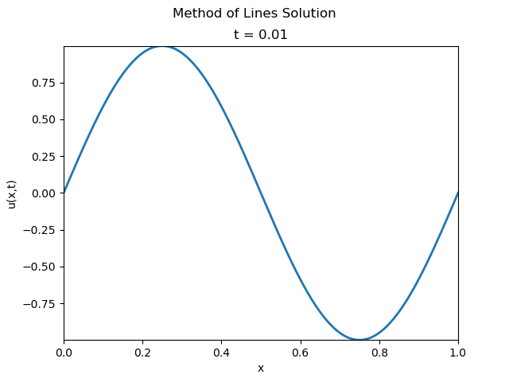

+++
date = "2025-09-21T16:35:38+01:00"
draft = false
title = "Visualising the Heat Equation"
tags = ['Mathematics', 'Numerical Analysis', 'Differential Equations']
+++


## What is the Heat Equation?
The term "Heat Equation" refers to a Partial Differential Equation (PDE)
of the form:
$$
    \frac{\partial u}{\partial t} = \kappa \nabla^2 u
$$
where \\(u = u(\mathbf x, t)\\). The parameter \\(\kappa\\) (sometimes
\\(\alpha\\) is used instead) is the "diffusivity constant"

It arises in many areas of Applied Mathematics and Physics
such as
1. Particle diffusion
2. Financial maths
3. Image analysis

For more information, see the [Wikipedia page](https://en.wikipedia.org/wiki/Heat_equation)

I wish to solve this to learn more about how we can solve PDEs numerically,
and to make a nice visualisation to go along with my numerical solution.
First, we will take a look at a way we can solve the equation numerically,
and then simply transfer our analytical solution across to the computer. Then
we will look at a more "numerical" way of approaching it.

## Our Problem
The specific heat problem we are going to solve is as follows:
$$
    \frac{\partial u}{\partial t} = \kappa \frac{\partial^2 u}{\partial x^2}
$$
for \\(x \in (0,L)\\) and \\(t \ge 0\\) with boundary conditions:
1. \\(u(0, t) = 0\\)
2. \\(u(L, t) = 0\\)

and initial condition: \\(u(x,0) = f(x)\\).

Essentially, we are solving the Heat Equation _on a rod_ with temperature 0
on the boundaries with arbitrary diffusivity constant, rod length and 
initial condition.

### Visualisation
I think a sensible place to start is writing the code for visualising a solution.
This might be over-engineering, but I like the idea of having an abstract class
which implements a `visualise` method, and forces subclasses to implement some
method which gives the solution at a given value at \\(x\\) and \\(t\\).



Now, we can make a class for each method, implementing `u(x,t)` as required.
For example:



Alternatively, if you wanted to do it functionally, you could always just
pass the appropriate solving function (in our OOP case: the `u(x,t)`'s) into
the visualise function; but this way was calling to me.

## Separation of Variables
A popular method for solving PDEs analytically is the [Separation of Variables](https://en.wikipedia.org/wiki/Separation_of_variables)
method. We explicitly seek "separable solutions". In this case, it will be
solutions of the form
$$
    u(x,t) = X(x)T(t)
$$

Also, it exploits a key fact about solutions to PDEs:
- **Linear Superposition:** if the PDE and BCs are linear and homogeneous, the
sum of two solutions gives us another solution

The method goes something like this:
1. **Ansatz:** Assume that \\(u = XT\\)
2. **Substitution:** Substitute this ansatz into the original equation, you should
uncover ODEs for \\(X, T\\) coupled by some constant (\\(\lambda\\)). The ODE for
\\(X(x)\\) is the _eigenvalue problem_, we solve this first.
3. **Solving:** Seek non-zero solutions to the eigenvalue problems. We should
get eigenvalues \\(\lambda_n\\) and eigenfunctions \\(X_n\\) which satisfy
the ODE and BCs for appropriate \\(n\\)
4. **Solving:** Now solve the ODE for \\(T(t)\\), we should get more functions
\\(T_n\\).
5. **Combining:** We can now combine our solutions to get our general solution
of the form
$$
    u(x,t) = \sum_{n=0}^\infty X_n(x) T_n(t)
$$
6. **Initial Conditions:** Now can apply the initial condition for the PDE,
this should let us solve for any remaining constants (apart from the ones
appearing in the original PDE of course).

For the sake of brevity, I won't go through the working for this problem.
However, the general solution we obtain is:
$$
    u(x,t) = \sum_{n=0}^\infty A_n 
    \sin \left( \frac{n \pi x}{L} \right) 
    \exp \left( -\left(\frac{n \pi}{L}\right)^2 \kappa t \right)
$$
Then we can solve for the \\(A_n\\) by recognising that \\(u(x,0)\\) is a
(Fourier) sine series. Then we obtain that:
$$
    A_n = \frac{2}{L} \int_0^L f(x) \sin \left( \frac{n \pi x}{L} \right)\\, dx
$$

### Implementing This Method Numerically
Implementing this method is quite simple, especially in this case. We need to
do two things:
1. Calculate the \\(A_n\\) using some numerical integration scheme
2. Truncate the series and sum it like one normally would

My implementation is as follows:



To see what the solution looks like, let's visualise our problem with:
- \\(\kappa = 0.1\\)
- \\(L = 1\\)
- \\(f(x) = \sin(2 \pi x)\\)

This visualisation was created using the `series_visualisation` script available
in the repository.

## Finite Difference Methods
Another way we can approach solving PDEs numerically is using _finite difference
schemes_. In short, we discretise the domain and solve the differential equation
on a grid of points. Specifically, this method is known as the [Method of Lines](https://en.wikipedia.org/wiki/Method_of_lines)

To avoid going into too much detail in this post, I will simply give a brief
outline of how we are going to apply it to the Heat Equation.

1. **Discretise in Space:** Split the spatial domain \\((0, L)\\) into points
\\(x_1, x_2, \dots, x_n\\). From this, we can uncover coupled differential
equations for \\(u_j(t) = u(x_j, t)\\)
2. **Organise:** We then organise these differential equations into a vector
ODE.
3. **Discretise in Time:** Finally we can discretise the resulting ODE with
respect to \\(t\\), by considering \\(\mathbf u^j = \mathbf{u}(t_j) = (u(x_1, t_j), \dots, u(x_n, t_j))\\).

Let \\(\Delta t, \Delta x\\) be the spacing between subsequent grid points.
For space derivatives, we will use the _central difference approximation_:
$$
    \frac{\partial^2 u}{\partial x^2}(x=x_j)=
    \frac{u_{j-1} - 2u_j + u_{j+1}}{\Delta x^2}
$$

For time derivatives, we will use the _trapezoidal scheme_:
$$
    \frac{\mathbf u^{j+1} - \mathbf u^j}{\Delta t} 
    = \frac{A \mathbf u^{j+1} + A \mathbf u^j}{2}
$$
where \\(A\\) is the matrix we uncover when organising the space ODEs into
a single vector ODE.

Using the method of lines, with these finite difference schemes on the Heat Equation
is also known as the [Crank-Nicolson Scheme](https://en.wikipedia.org/wiki/Crank%E2%80%93Nicolson_method). 
When we follow this method through, we get that:
$$
    \left(I - \frac{\Delta t}{2} A\right) \mathbf u^{j+1} = \left(I + \frac{\Delta t}{2} A\right) \mathbf u^j
$$
where
$$
    A = \frac{1}{\Delta x^2} \begin{pmatrix}
       -2 & 1 \\\
       1 & -2 & 1 \\\
       & 1 & -2 & 1 \\\
       & & \ddots & \ddots & \ddots \\\
       & & & 1 & -2 & 1 \\\
       & & & & 1 & -2 & 1 \\\
       & & & & & 1 & -2
    \end{pmatrix}
$$

### Implementing This Method
Unlike the series solution, we need to be a bit more considerate about how we
implement it since the naive method would be to take the inverse of matrix
sum on the left. However, _inverses are computationally expensive_.

Instead, we take the _LU decomposition_ and solve the system of equations
in that way. This is much cheaper! 

My implementation is as follows:



If we visualise the problem with the same parameters as with the series solver,
we obtain a very familiar animation:

This visualisation was created with the `mol_visualisation` script available
in the repository.

## Comparing the Methods
So why do we have different methods for doing the same thing? One must be 
definitively better than the other... right?

Well let's consider the pros of the series solution first:
1. The full analytical solution is exact, so the only error we obtain in the implementation
is the truncation and integration error.
2. The implementation is much more straightforward and each term of the series,
no matter how complex it is, can be computed in parallel.

However, it has some drawbacks:
1. It was easy to do in this case since we had a simple domain: a rod. The
difficulty ramps up when we consider more complex geometries and PDEs.
2. The coefficients are obtained by integration which can introduce more error
into the solution.

As for the Crank-Nicolson scheme:
1. We can generalise it to more complex geometries: we just need to set up
the grid appropriately.
2. This scheme is stable for any choice of timestep, while still being decently simple to
implement.

Nonetheless:
1. There's more room for error since we are discretising a continuous domain
2. If we have a very fine grid (i.e. many grid points), we'd have to solve
a very large system of linear equations.
3. Accuracy is dependent on choosing a small enough step size.

In short: the series solution is elegantly straightforward for problems with
simple boundary conditions and domains, but doesn't scale well to complex PDEs.
For these, it is easier to turn to finite difference
methods, like the Method of Lines, which give us a general recipe to tackle
any PDE: discretise, approximate, solve.

Therefore, it's quite easy to see how analytical solutions are highly elegant
and can reveal the structure of the solution; whereas numerical
methods are built for flexibility to allow us to solve a large range of PDEs,
even those we cannot solve analytically.

It is important to note, however, that there are many more methods to solve PDEs
which we haven't considered, e.g. [Spectral Methods](https://en.wikipedia.org/wiki/Spectral_method)
which borrows key ideas from the Separation of Variables method.
